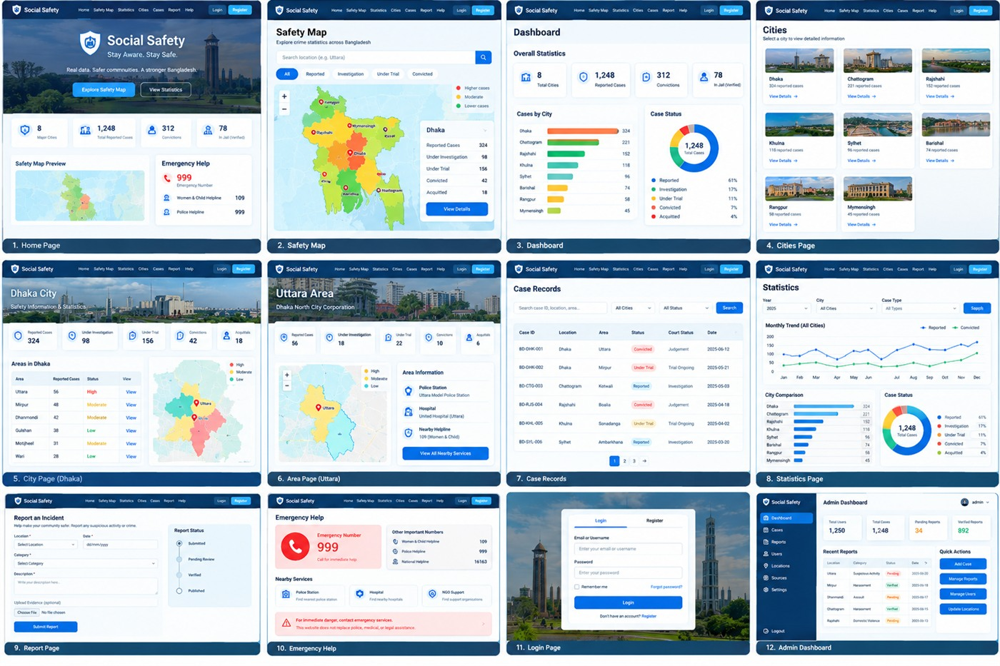

# Social Safety BD 🇧🇩

A public-safety awareness portal for Bangladesh: an interactive map of all 64
districts, a case-records directory that cites the relevant penal-code
sections, community incident reporting with staff moderation, and an anonymous
help-chat routed to the visitor's upazila.

Built as a full-stack portfolio project with **Django + Django REST Framework**
on the backend and **React 19 + Vite** on the frontend.

> **All statistics in this repository are synthetic.** They are generated from
> a stable hash for UI development and are labelled as fabricated everywhere
> they appear. They are not crime data. See [Data and ethics](#data-and-ethics).



## Features

| Area | What it does |
| --- | --- |
| **Interactive map** | All 64 districts with real coordinates, colour-coded risk markers, legend, and click-to-zoom. Filter by division or free-text search. |
| **Case records** | Verified-only case directory with category, court stage, and penal-code section citations, plus a detail page per case. |
| **Community reporting** | Visitors submit incidents with optional evidence upload; staff review and moderate them from the Django admin. |
| **Upazila help chat** | Anonymous visitors open a thread for their upazila; staff reply from an in-app inbox. Polling, thread lifecycle, and message history. |
| **Dashboard** | Aggregate statistics by district, court stage, and monthly trend. |
| **Auth** | Email/password registration, login, logout, and a current-user endpoint with staff-only boundaries. |
| **Responsive UI** | Mobile-first layout, accessible focus states, and reduced-motion support. |

## Tech stack

**Backend** — Python, Django 5.2, Django REST Framework, django-cors-headers,
SQLite (development), session auth, Django admin

**Frontend** — React 19, Vite 7, React Router 7, Leaflet (react-leaflet 5),
Recharts, lucide-react, plain CSS

**Tooling** — GitHub Actions CI, Django test runner, Vite dev proxy

## Project structure

```
backend/
  api/
    models.py            City, Area, Case, Upazila, ChatThread, ChatMessage, SafetyReport
    views.py             Plain-Django JSON views (no DRF serializers)
    urls.py              /api/* routes
    admin.py             Staff moderation panels
    tests/               78 tests: seed integrity, API filters, auth, chat lifecycle
    management/commands/ seed_demo, seed_upazilas
  social_safety/         Settings, root URLconf, WSGI
frontend/
  src/
    App.jsx              Routes and layout
    data.js              UI constants
    api.js               API client with a relative /api base
    styles.css           Design system
docs/prototype.jpg       Full UI walkthrough
```

## Getting started

### 1. Backend

```bash
cd backend
python -m venv venv
source venv/bin/activate          # Windows PowerShell: .\venv\Scripts\Activate.ps1
pip install -r requirements.txt
python manage.py migrate
python manage.py seed_demo --reset
python manage.py runserver
```

The API is then available at `http://127.0.0.1:8000/api`.

If PowerShell blocks script activation, skip it and call the interpreter
directly: `.\venv\Scripts\python.exe manage.py runserver`.

Create a staff account to reach the Django admin and the staff chat inbox:

```bash
python manage.py createsuperuser
```

### 2. Frontend

In a second terminal:

```bash
cd frontend
npm install
npm run dev
```

Open `http://localhost:5173`.

### Why there is no CORS setup

The frontend requests **`/api` as a relative path**, and the Vite dev server
proxies it to `http://127.0.0.1:8000`. The browser therefore only ever talks to
a single origin and CORS never enters the picture during development.

To point the dev proxy somewhere else, set `VITE_BACKEND_URL`. To send requests
to an absolute API host instead, set `VITE_API_URL`. Both are documented in
`frontend/.env.example`.

## Tests

The backend has a real test suite covering seed-data integrity, API filtering,
verification boundaries, auth and staff-authorization rules, and the full chat
lifecycle.

```bash
cd backend
python manage.py test api          # 78 tests
python manage.py test api -v 2     # per-test output
```

CI runs the same suite plus a production frontend build on every push to
`main`. See `.github/workflows/ci.yml`.

## API reference

All responses are JSON. Session authentication is used throughout.

### Public

| Method | Endpoint | Description |
| --- | --- | --- |
| `GET` | `/api/health/` | Liveness probe |
| `GET` | `/api/cities/` | All districts with coordinates and totals |
| `GET` | `/api/areas/?city=<slug or name>` | Areas, optionally filtered by district |
| `GET` | `/api/cases/` | Verified cases. Supports `?search=`, `?status=`, `?category=`, `?city=` |
| `GET` | `/api/cases/<case_id>/` | Single verified case |
| `GET` | `/api/statistics/` | Aggregate totals and court-stage breakdown |
| `GET` | `/api/upazilas/` | Upazilas. Supports `?district=`, `?search=` |
| `POST` | `/api/chat/threads/` | Open a help thread (`upazila`, `message`, `subject`) |
| `GET`/`POST` | `/api/chat/threads/<id>/` | Read a thread / add a reply |
| `POST` | `/api/reports/` | Submit an incident (multipart, optional evidence) |

### Authenticated

| Method | Endpoint | Description |
| --- | --- | --- |
| `POST` | `/api/register/` | Create an account and sign in |
| `POST` | `/api/login/` | Sign in with email and password |
| `POST` | `/api/logout/` | End the session |
| `GET` | `/api/me/` | Current user, or `{authenticated: false}` |

### Staff only

| Method | Endpoint | Description |
| --- | --- | --- |
| `GET`/`PATCH` | `/api/admin/reports/` | Review and moderate submitted reports |
| `GET`/`POST` | `/api/admin/chat/` | Staff inbox: list threads, reply, close |

Unverified cases are never returned by the public API — a test asserts this, and
another asserts the case-detail payload contains no personal-identifying fields.

## Data and ethics

This project touches a sensitive subject area, so its data policy is a design
constraint rather than an afterthought.

**Every statistic is synthetic.** Figures are derived from a SHA-256 hash of each
district name, then scaled by population so the demo looks plausible. They are
stable across re-seeding, which is what makes the seed command idempotent and
testable — but they are fabricated. Every seeded case is tagged
`SYNTHETIC demo record - fabricated for prototyping, not real data`, the seeder
prints a warning, and the UI carries a site-wide banner. Automated tests assert
that the synthetic marker is present on every case.

**Deliberately not implemented: naming individuals.** The original brief asked
for a "photo wall of verified offenders". That was not built, and would not be.
Publishing a photo, name, or address of an accused person — especially someone
awaiting trial — risks irreversible harm and undermines a fair process. Instead,
case records carry **offence classification, court stage, and statutory section
citations**, which is the information a public-safety portal can actually
defensibly publish.

**Publishing rules for anyone extending this:** no victim identities, private
addresses, or phone numbers; no unverified accusations; never label a person a
criminal on the basis of a complaint alone. Public case data should come from
lawful, authoritative sources with visible source and verification metadata.

## Known limitations

Listed deliberately — these are the things I would fix first, not an attempt to
present the project as finished.

- **CSRF protection is disabled** on the mutating endpoints via `@csrf_exempt`,
  and anonymous chat has no rate limiting. Both must be fixed before real users.
- **Upazila coverage is partial** — 289 of roughly 495, hand-built. It needs to
  be replaced with the official LGED/BBS gazetteer.
- **Statistics are not real data.** They need authoritative, auditable sources
  before the demo banner can come down.
- **SQLite and synchronous views.** Fine for a demo; production needs a
  real database, a WSGI server, and caching.
- **No frontend test suite.** The backend is covered; the React side is not.

## Production configuration

```text
DJANGO_SECRET_KEY=<strong-random-secret>
DJANGO_DEBUG=False
DJANGO_ALLOWED_HOSTS=<your-backend-domain>
CORS_ALLOWED_ORIGINS=https://<your-frontend-domain>
```

Then `python manage.py collectstatic --noinput` and serve behind a real WSGI
server such as Gunicorn, with HTTPS, secure cookies, and database backups.

## License

[MIT](LICENSE) © 2026 Mausd34
