# Social Safety BD 🇧🇩

A public-safety awareness portal for Bangladesh: an interactive map of all 64
districts, a case-records directory that cites the relevant penal-code
sections, community incident reporting with staff moderation, an anonymous
help-chat routed to the visitor's upazila, and a hotel safety directory where
travellers rate where they felt safe staying.

Built as a full-stack portfolio project with **Django + Django REST Framework**
on the backend and **React 19 + Vite** on the frontend.

> **All statistics in this repository are synthetic.** They are generated from
> a stable hash for UI development and are labelled as fabricated everywhere
> they appear. They are not crime data. See [Data and ethics](#data-and-ethics).

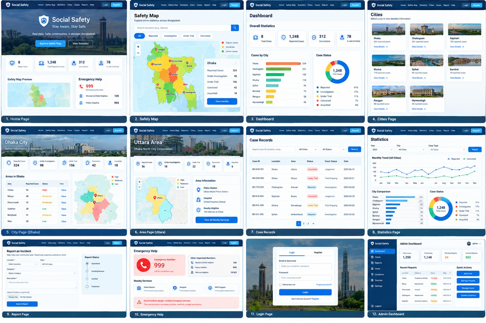

## Screenshots

Captured from the running app against seeded demo data. Regenerate them with
`npm run dev` plus `manage.py runserver`, then a headless browser.

| Home | Safety map |
| --- | --- |
| 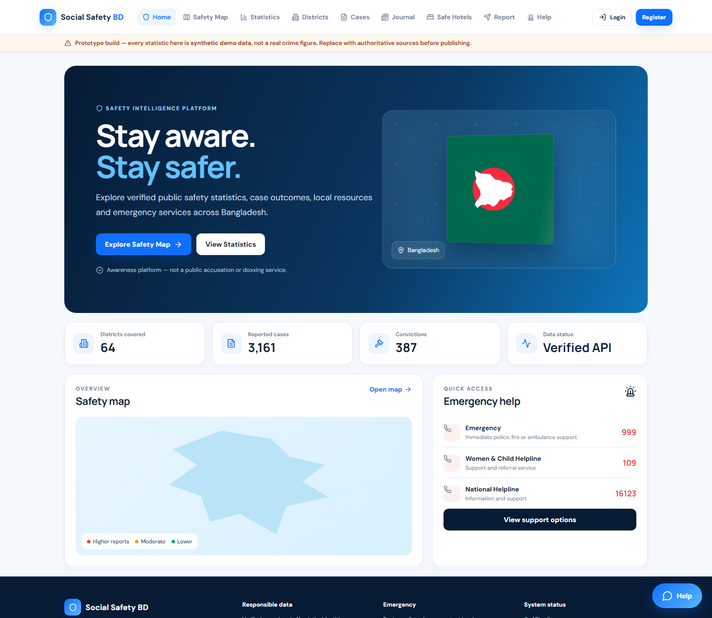 | 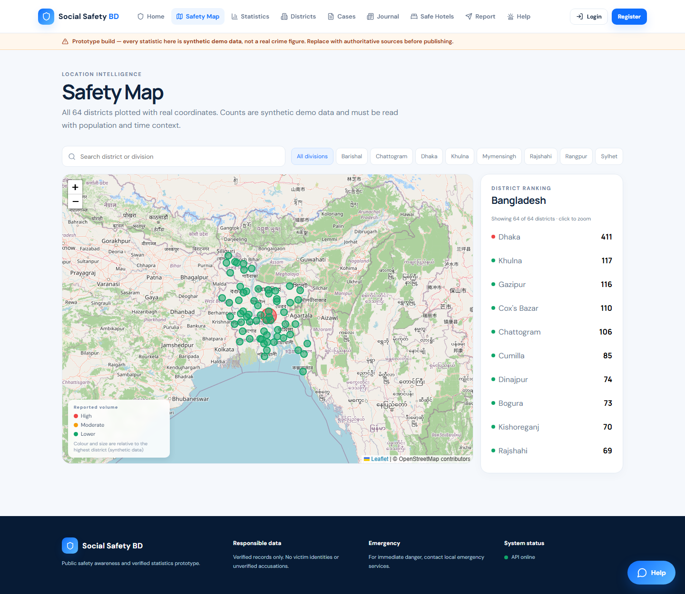 |

| Statistics | Districts |
| --- | --- |
| 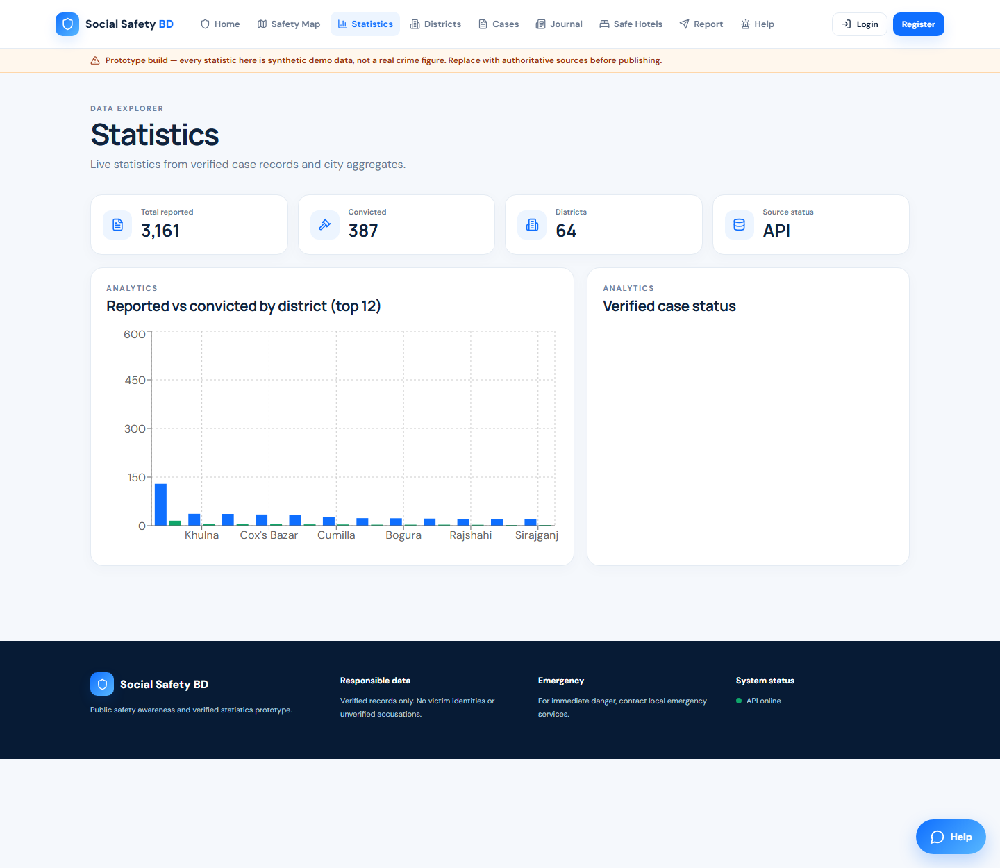 | 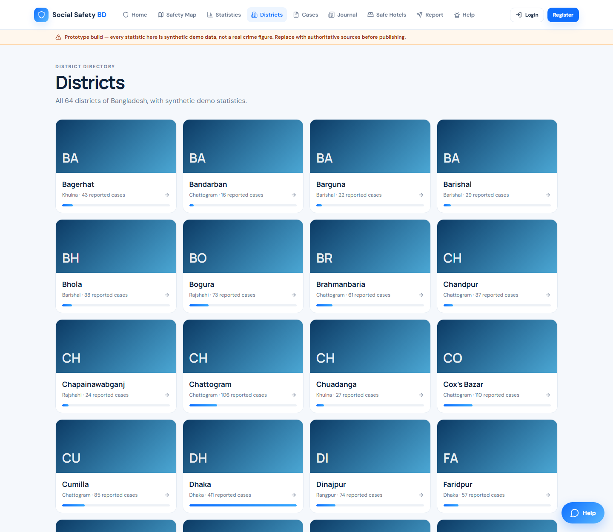 |

| District profile | Case records |
| --- | --- |
| 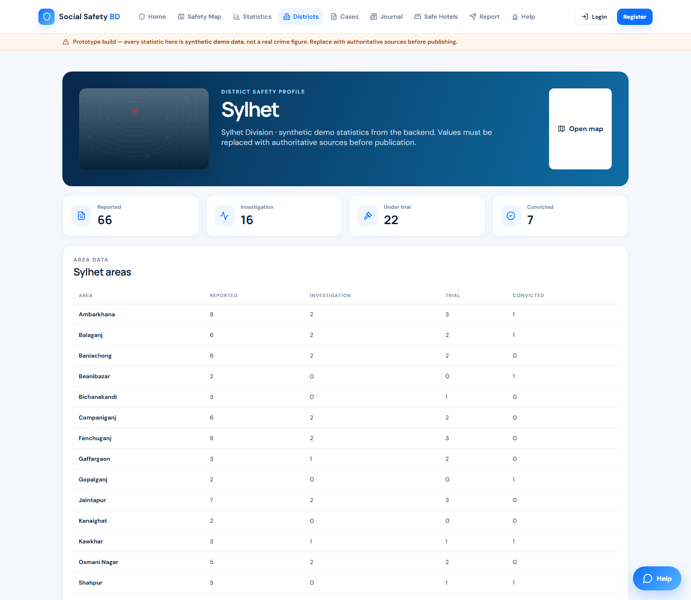 | 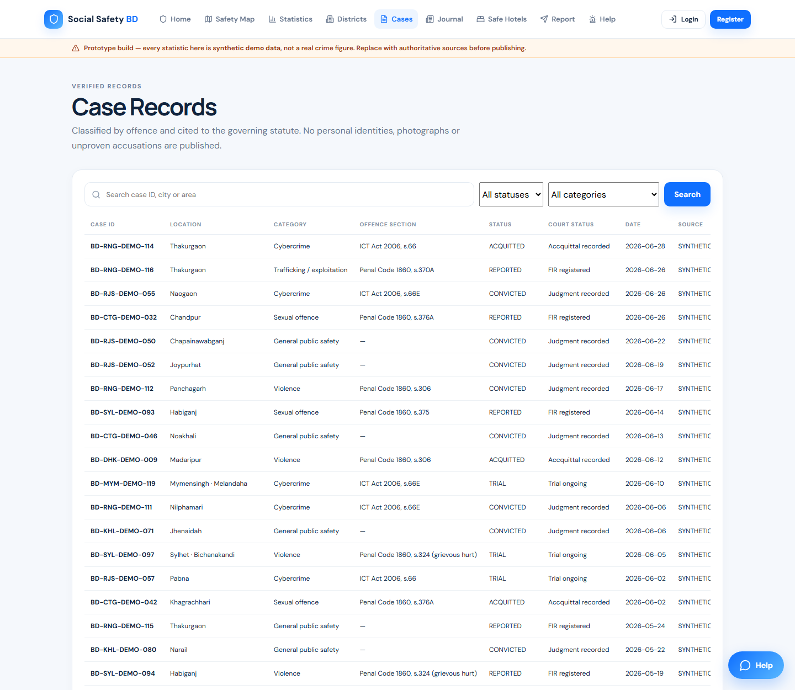 |

| Safe hotels | Citizen journal |
| --- | --- |
| 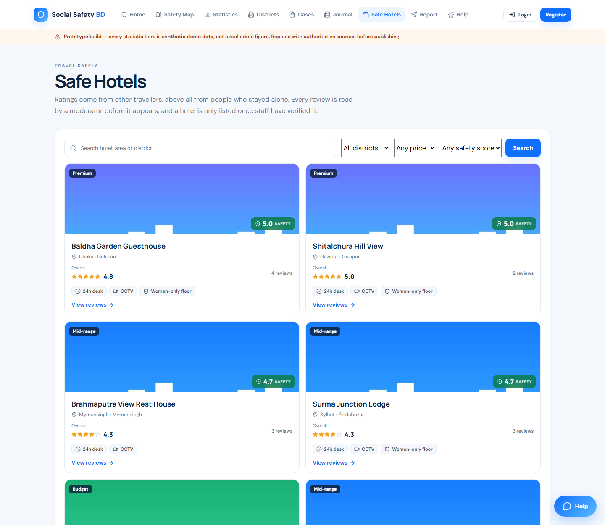 | 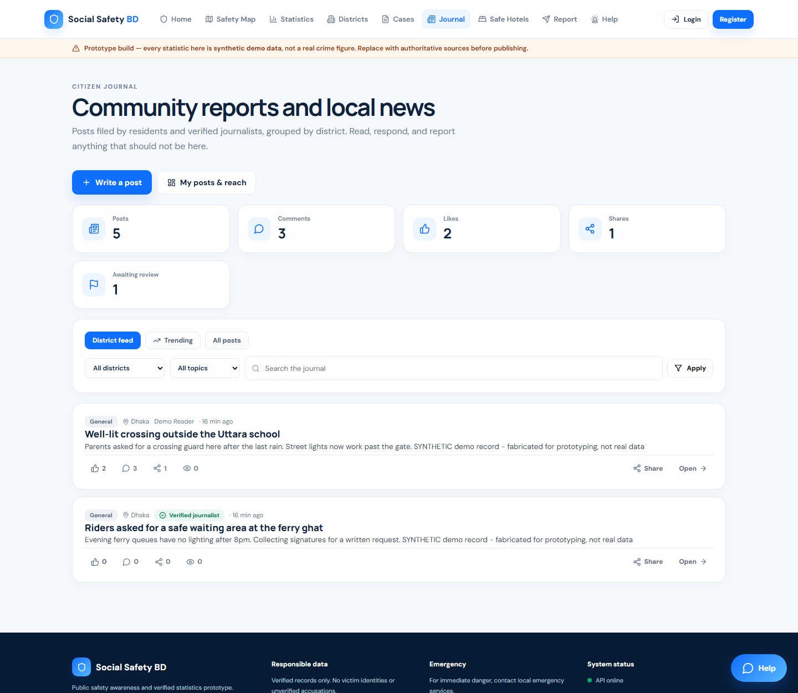 |

| Journal post | Emergency help |
| --- | --- |
| 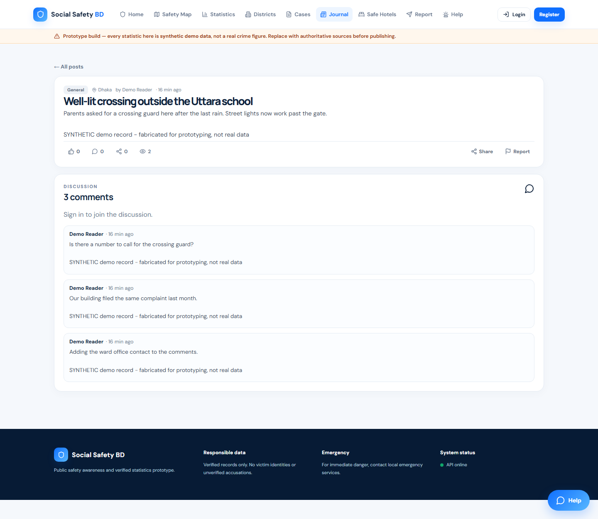 | 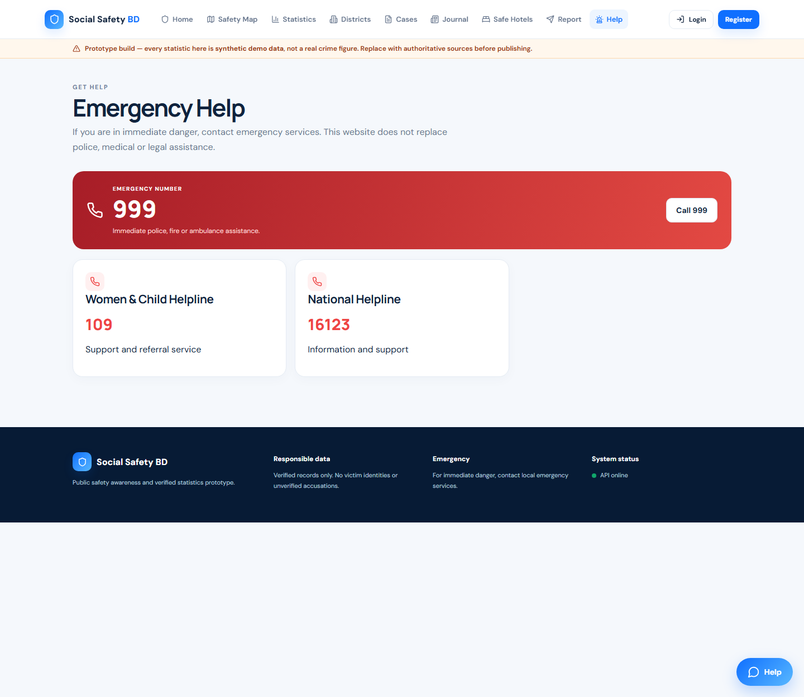 |

## Features

### Safety data

| Area | What it does |
| --- | --- |
| **Interactive map** | All 64 districts with real coordinates, colour-coded risk markers, legend, and click-to-zoom. Filter by division or free-text search. |
| **Case records** | Verified-only case directory with category, court stage, and penal-code section citations, plus a detail page per case. |
| **Districts** | Per-district pages carrying case tallies, coordinates, and the offence breakdown, each with generated map artwork. |
| **Dashboard** | Aggregate statistics by district, court stage, and monthly trend. |

### Citizen journal (`/journal`)

Community posts filed against a district, kept in a **separate Django app**
(`backend/journal/`) so the case-tracking side is untouched and the two can
ship independently.

| Area | What it does |
| --- | --- |
| **Feeds** | District feed, trending ranking weighted by engagement and faded by age, and a full list — all with district, topic and text filters. |
| **Posts** | Write, edit and delete. Optional display name, so a tip can be filed without exposing an account. Image upload capped at 5 MB. |
| **Comments** | Threaded replies on any post, with likes. |
| **Engagement** | Like toggles, share tracking by channel, and view counts. |
| **Verification** | Journalists apply once; staff approve or reject, and approved bylines carry a verified badge across the journal. |
| **Moderation** | Anyone — including signed-out visitors — can report a post or comment. Staff work a queue and record a resolution. |
| **Author dashboard** | Your posts (including rejected ones, so you can see why), plus views, likes, shares, comments and flags received. |

### Community and support

| Area | What it does |
| --- | --- |
| **Community reporting** | Visitors submit incidents with optional evidence upload; staff review and moderate them from the Django admin. |
| **Upazila help chat** | Anonymous visitors open a thread for their upazila; staff reply from an in-app inbox. Polling, thread lifecycle, and message history. |
| **Hotel safety directory** | Browse verified hotels by district, area, price and search, each card showing a photo and a colour-coded safety score. Guests rate a stay and tick "I was travelling alone", which is weighted in the UI. Staff moderate every review from the admin dashboard before it is published. |
| **Emergency help** | One-tap dialling for 999, 109 and 16123. |

### Platform

| Area | What it does |
| --- | --- |
| **Auth** | Email/password registration, login, logout, and a current-user endpoint with staff-only boundaries. |
| **Moderation admin** | Staff-only dashboard: safety-report queue, help-desk inbox, hotel review queue, journal report queue, journalist approvals. |
| **Django admin** | Bulk publish/reject on posts, moderation queues, and bulk approval actions. |
| **Responsive UI** | Mobile-first layout, accessible focus states, and reduced-motion support. |

## Tech stack

**Backend** — Python, Django 5.2, Django REST Framework, django-cors-headers,
SQLite (development), session auth, Django admin

**Frontend** — React 19, Vite 7, React Router 7, Leaflet (react-leaflet 5),
Recharts, lucide-react, plain CSS

**Tooling** — GitHub Actions CI, Django test runner, Vite dev proxy

## Project structure

```
backend/
  api/
    models.py            City, Area, Case, Upazila, ChatThread, ChatMessage, SafetyReport, Hotel, HotelReview
    views.py             Plain-Django JSON views (no DRF serializers)
    urls.py              /api/* routes
    admin.py             Staff moderation panels
    tests/               121 tests: seed integrity, API filters, auth, chat lifecycle, hotel moderation
    management/commands/ seed_demo (districts, cases, hotels), seed_upazilas
  journal/               Citizen-journal layer (posts, comments, engagement, moderation)
    models.py            Post, Comment, Like, Share, ModerationFlag, JournalistVerification, PostAnalytics
    views.py             Plain-Django JSON views (no DRF serializers)
    urls.py              /api/journal/* routes
    admin.py             Bulk publish/reject, moderation queue, journalist approvals
    tests/               59 tests: publishing, permissions, engagement, moderation, CSRF safety
    management/commands/ seed_journal (demo posts, comments, a pending application)
  social_safety/         Settings, root URLconf, WSGI
  docs/
    prototype.jpg        Original 12-screen walkthrough
    screens/             Per-page screenshots embedded in this README
frontend/
  src/
    App.jsx              Routes and layout
    data.js              UI constants
    api.js               API client with a relative /api base
    styles.css           Design system
```

## Citizen journal

A second feature area, mounted at `/api/journal/`, for community posts rather
than official case records. It is a separate Django app (`backend/journal/`)
so the case-tracking side is untouched and the two can ship independently.

| Page | Route | What it does |
| --- | --- | --- |
| Journal | `/journal` | District feed, trending ranking, and every post, with district/topic filters and search |
| Post | `/journal/:id` | Full post, threaded comments, like, share, and report |
| Write | `/journal/new` | Publish a post with an optional byline name |
| My posts | `/journal/mine` | Everything you published, your reach, and the journalist application |
| Admin | `/admin` | Staff-only report queue and journalist approvals |

Models: `Post`, `Comment`, `Like`, `Share`, `ModerationFlag`,
`JournalistVerification`, `PostAnalytics`.

Two rules worth knowing before you change this code:

- **An author can edit and delete their own posts but cannot change moderation
  status.** Only staff can reject, and a rejected post vanishes from public
  listings while staying visible to its author.
- **Reader reports are open to signed-out users.** The people most likely to
  notice a dangerous or defamatory post are often the least willing to
  register, and staff triage the queue by hand anyway.

Integrity is enforced in the database rather than only in the views: check
constraints make a `Like` and a `ModerationFlag` target exactly one of
post/comment, because SQL unique constraints ignore NULLs and would otherwise
allow duplicate comment likes.

`journal/tests/test_csrf.py` deserves a mention — Django's default test client
disables CSRF checks, so a view missing `@csrf_exempt` passes every other test
and then fails with a 403 the first time a real browser posts to it. Those
tests use a CSRF-enforcing client to cover the browser path.

### Journal API

All under `/api/journal/`, plain JSON, session auth.

| Method | Path | Notes |
| --- | --- | --- |
| `GET` `POST` | `/posts/` | List with `city`, `category`, `q`, `author`, `limit`, `offset`; create (login) |
| `GET` | `/posts/trending/` | Engagement ranking, 30-day window |
| `GET` | `/posts/{id}/` | Detail; `PATCH`/`DELETE` for the author or staff |
| `POST` `DELETE` | `/posts/{id}/like/` | Toggle |
| `POST` | `/posts/{id}/share/` | `LINK`, `FACEBOOK`, `WHATSAPP`, `X`, `OTHER` |
| `POST` | `/posts/{id}/view/` | View counter, open to anonymous |
| `GET` | `/posts/{id}/comments/` | Published comments |
| `POST` | `/comments/` | Add; pass `parent` to reply |
| `GET` `PATCH` `DELETE` | `/comments/{id}/` | Edit for the author, moderate for staff |
| `POST` `DELETE` | `/comments/{id}/like/` | Toggle |
| `GET` | `/feed/` `search/` `stats/` | Personalised feed, combined search, headline counts |
| `GET` | `/me/posts/` `me/analytics/` | Author's own posts and reach (login) |
| `POST` | `/flags/` | File a report — open to signed-out users |
| `POST` | `/journalist/apply/` | Apply for the badge (login, once per account) |
| `GET` `PATCH` | `/admin/flags/` `admin/journalists/` | Staff-only queues |

## Testing notes

Two bugs in this repository were invisible to the test suite and only showed up
when the app was actually run. Both are now guarded:

- **CSRF.** See `journal/tests/test_csrf.py` above.
- **Effect cleanups.** Several pages called `useEffect(load, [deps])` where
  `load` returns a Promise. React treats an effect's return value as the cleanup
  function, so under `React.StrictMode` — which double-invokes effects in
  development — it immediately tried to call the Promise, and
  `/hotels` and `/cases` rendered blank with
  `TypeError: destroy is not a function`. It would also have broken in
  production whenever the user navigated away. All six are now
  `useEffect(() => { load() }, [deps])`.

Both were found by driving a headless browser against the running app, which
is worth doing after any change to a page's effects.

## Getting started

### Prerequisites

| Tool | Version | Check with |
| --- | --- | --- |
| Python | 3.10+ (3.12 used in CI) | `python --version` |
| Node.js | 20.19+ or current LTS | `node --version` |
| Git | any recent | `git --version` |

You need **two terminals**: one for Django, one for Vite.

### 1. Backend

```bash
cd backend
python -m venv venv
source venv/bin/activate          # Windows PowerShell: .\venv\Scripts\Activate.ps1
pip install -r requirements.txt
python manage.py migrate
python manage.py seed_demo --reset
python manage.py runserver
```

The API is then available at `http://127.0.0.1:8000/api`.

`--reset` wipes and rebuilds the demo data. Plain `python manage.py seed_demo` is
idempotent and safe to re-run, so use it if you already have a database you
care about.

If PowerShell blocks script activation, skip it and call the interpreter
directly: `.\venv\Scripts\python.exe manage.py runserver`.

Confirm it is alive before moving on:

```bash
curl http://127.0.0.1:8000/api/health/
# {"status": "ok", "service": "Social Safety BD API"}
```

Create a staff account to reach the Django admin and the staff chat inbox:

```bash
python manage.py createsuperuser
```

### 2. Frontend

In a second terminal:

```bash
cd frontend
npm install
npm run dev
```

Open `http://localhost:5173`. The map, statistics and case pages will be
populated; if a page looks empty, the backend is probably not running.

### Ports and URLs

| Service | URL | Notes |
| --- | --- | --- |
| Django API | `http://127.0.0.1:8000/api` | JSON only |
| Django admin | `http://127.0.0.1:8000/admin` | Staff login required |
| Vite dev server | `http://localhost:5173` | Proxies `/api` to Django |
| Vite preview | `http://localhost:4173` | After `npm run build` |

### If the frontend will not connect

Use **`localhost`**, not `127.0.0.1`. Vite's default host resolves through
`localhost`, which on some machines is IPv6 (`::1`) only — in that case
`http://127.0.0.1:5173` is refused even though the server is running. If you
need to reach the dev server from another device on the network, start it with:

```bash
npm run dev -- --host
```

That binds all interfaces, so anything on your LAN can load the app while it
runs. Keep it off otherwise.

### Routes

| Path | Page |
| --- | --- |
| `/` | Home |
| `/map` | Interactive safety map |
| `/statistics` | Analytics |
| `/cities` | District directory |
| `/cities/<slug>` | District profile |
| `/cases` | Case records |
| `/cases/<case_id>` | Case detail |
| `/hotels` | Safe hotel directory, filterable |
| `/hotels/<id>` | Hotel detail, reviews and the rate-this-stay form |
| `/report` | Community reporting |
| `/emergency` | Emergency help |
| `/login`, `/register` | Auth |
| `/admin` | Staff moderation dashboard |

### Everyday commands

```bash
# Backend
cd backend
python manage.py test api                  # run the suite
python manage.py makemigrations            # after changing models.py
python manage.py migrate                   # apply migrations
python manage.py createsuperuser           # staff account
python manage.py seed_upazilas             # (re)load upazila data

# Frontend
cd frontend
npm run dev                                # dev server with HMR
npm run build                              # production bundle into dist/
npm run preview                            # serve the built bundle
```

### Why there is no CORS setup

The frontend requests **`/api` as a relative path**, and the Vite dev server
proxies it to `http://127.0.0.1:8000`. The browser therefore only ever talks to
a single origin and CORS never enters the picture during development.

To point the dev proxy somewhere else, set `VITE_BACKEND_URL`. To send requests
to an absolute API host instead, set `VITE_API_URL`. Both are documented in
`frontend/.env.example`.

The dev proxy forwards **both** `/api` and `/media`, so an uploaded hotel photo
is fetched from Django rather than 404ing against the Vite origin.

## Tests

The backend has a real test suite covering seed-data integrity, API filtering,
verification boundaries, auth and staff-authorization rules, the full chat
lifecycle, and hotel review moderation.

```bash
cd backend
python manage.py test api journal     # 190 tests
python manage.py test api -v 2     # per-test output
```

CI runs the same suite plus a production frontend build on every push to
`main`. See `.github/workflows/ci.yml`.

## API reference

All responses are JSON. Session authentication is used throughout.

### Public

| Method | Endpoint | Description |
| --- | --- | --- |
| `GET` | `/api/health/` | Liveness probe |
| `GET` | `/api/cities/` | All districts with coordinates and totals |
| `GET` | `/api/areas/?city=<slug or name>` | Areas, optionally filtered by district |
| `GET` | `/api/cases/` | Verified cases. Supports `?search=`, `?status=`, `?category=`, `?city=` |
| `GET` | `/api/cases/<case_id>/` | Single verified case |
| `GET` | `/api/statistics/` | Aggregate totals and court-stage breakdown |
| `GET` | `/api/upazilas/` | Upazilas. Supports `?district=`, `?search=` |
| `GET` | `/api/hotels/` | Verified hotels, safest first. Supports `?city=`, `?search=`, `?price=`, `?min_rating=` |
| `GET` | `/api/hotels/<id>/` | One hotel with its verified reviews and star breakdown |
| `POST` | `/api/hotels/reviews/` | Submit a review (`hotel`, `author_name`, `rating`, `safety_rating`, `solo_traveller`, `body`). Held as `PENDING` until moderated |
| `POST` | `/api/chat/threads/` | Open a help thread (`upazila`, `message`, `subject`) |
| `GET`/`POST` | `/api/chat/threads/<id>/` | Read a thread / add a reply |
| `POST` | `/api/reports/` | Submit an incident (multipart, optional evidence) |

### Authenticated

| Method | Endpoint | Description |
| --- | --- | --- |
| `POST` | `/api/register/` | Create an account and sign in |
| `POST` | `/api/login/` | Sign in with email and password |
| `POST` | `/api/logout/` | End the session |
| `GET` | `/api/me/` | Current user, or `{authenticated: false}` |

### Staff only

| Method | Endpoint | Description |
| --- | --- | --- |
| `GET`/`PATCH` | `/api/admin/reports/` | Review and moderate submitted reports |
| `GET`/`POST` | `/api/admin/chat/` | Staff inbox: list threads, reply, close |
| `GET`/`PATCH` | `/api/admin/hotels/reviews/` | Hotel review queue: list reviews, set `PENDING`/`VERIFIED`/`REJECTED` |

Unverified cases are never returned by the public API — a test asserts this, and
another asserts the case-detail payload contains no personal-identifying fields.

The same rule governs hotels, and it matters more there, because a safety rating
is a claim about a named business. A hotel is only listed or readable once
`verified` is set, and a review only appears publicly once a moderator marks it
`VERIFIED`. Pending and rejected reviews never reach the public API and never
influence the published averages. Both rules have dedicated tests.

**District artwork is generated, never photographed.**
`seed_district_photos` writes a map-style card per district into
`media/district-photos/`. It is not a stock image captioned with a real place
name, because that would imply it depicts that district. The colour comes from
a stable hash of the slug and the pin from the real coordinates, so the grid
looks varied and geographically sensible while claiming nothing. If this ever
becomes a real product, replace it with licensed photography and alt text
before launch.

## Data and ethics

This project touches a sensitive subject area, so its data policy is a design
constraint rather than an afterthought.

**Every statistic is synthetic.** Figures are derived from a SHA-256 hash of each
district name, then scaled by population so the demo looks plausible. They are
stable across re-seeding, which is what makes the seed command idempotent and
testable — but they are fabricated. Every seeded case is tagged
`SYNTHETIC demo record - fabricated for prototyping, not real data`, the seeder
prints a warning, and the UI carries a site-wide banner. Automated tests assert
that the synthetic marker is present on every case.

**Deliberately not implemented: naming individuals.** The original brief asked
for a "photo wall of verified offenders". That was not built, and would not be.
Publishing a photo, name, or address of an accused person — especially someone
awaiting trial — risks irreversible harm and undermines a fair process. Instead,
case records carry **offence classification, court stage, and statutory section
citations**, which is the information a public-safety portal can actually
defensibly publish.

**Hotel safety ratings are moderated.** A safety rating is a claim about a named,
real business, so the feature is built the same way as incident reports: a hotel
is invisible until staff verify it, and no review is published until a moderator
approves it. The model documents that any demo hotel names must be fictional —
rating a real hotel's safety would be defamatory — but no hotel seeder exists
yet, so add your own through the Django admin rather than inventing ratings for
real businesses.

**Publishing rules for anyone extending this:** no victim identities, private
addresses, or phone numbers; no unverified accusations; never label a person a
criminal on the basis of a complaint alone. Public case data should come from
lawful, authoritative sources with visible source and verification metadata.

## Known limitations

Listed deliberately — these are the things I would fix first, not an attempt to
present the project as finished.

- **Hotel data is entirely invented.** `seed_demo` creates 14 fictional hotels
  with generated gradient placeholders and moderated reviews, so a fresh clone
  has a browsable directory. Nothing in it refers to a real business, and it must
  stay that way — a real photograph or a safety rating attached to a real hotel
  would be misleading. If you add listings, tick **Verified** or they stay hidden.
- **Uploaded media is dev-only.** `/media/` is served by Django in `DEBUG` and
  proxied by Vite, so uploads work in development. Production needs a real media
  host or object storage.
- **CSRF protection is disabled** on the mutating endpoints via `@csrf_exempt`,
  and anonymous chat and hotel reviews have no rate limiting. Both must be fixed
  before real users.
- **Upazila coverage is partial** — 289 of roughly 495, hand-built. It needs to
  be replaced with the official LGED/BBS gazetteer.
- **Statistics are not real data.** They need authoritative, auditable sources
  before the demo banner can come down.
- **SQLite and synchronous views.** Fine for a demo; production needs a
  real database, a WSGI server, and caching.
- **No frontend test suite.** The backend is covered; the React side is not.

## Production configuration

```text
DJANGO_SECRET_KEY=<strong-random-secret>
DJANGO_DEBUG=False
DJANGO_ALLOWED_HOSTS=<your-backend-domain>
CORS_ALLOWED_ORIGINS=https://<your-frontend-domain>
```

Then `python manage.py collectstatic --noinput` and serve behind a real WSGI
server such as Gunicorn, with HTTPS, secure cookies, and database backups.

## License

[MIT](LICENSE) © 2026 Mausd34
